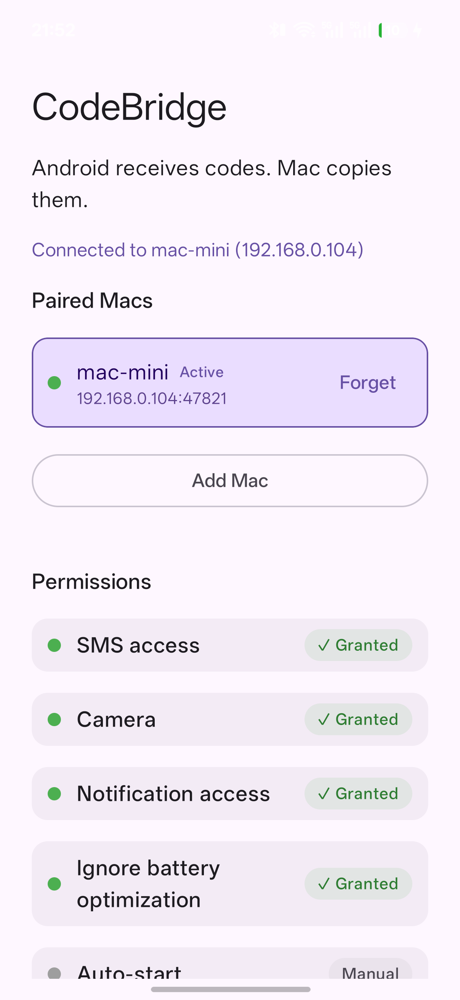
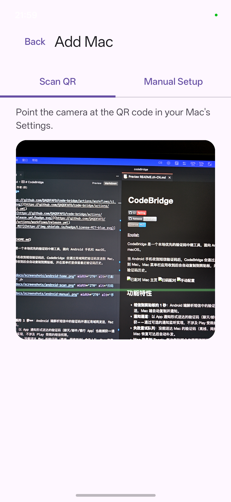
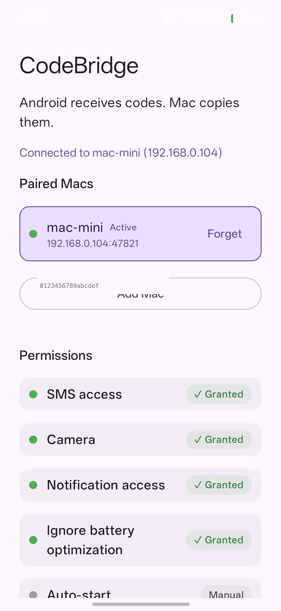

# CodeBridge

[](https://github.com/QAQDFAFD/code-bridge/actions/workflows/ci.yml)
[](https://github.com/QAQDFAFD/code-bridge/actions/workflows/release.yml)
[](LICENSE)

[中文说明](README.zh-CN.md)

CodeBridge is a tiny local-first OTP relay for Android and macOS.

When your Android phone receives a verification code, CodeBridge sends it to your Mac over the local network. The Mac menu bar app copies the code to the clipboard, shows a notification, and keeps a short recent-code history.

<p>
  
  
  
</p>

## Features

- **SMS → clipboard in about a second** on a local network: the Android app parses the OTP from incoming SMS and POSTs it to the Mac, which copies it and notifies you.
- **Notification channel**: OTPs delivered as app notifications (chat, mail, banking) are captured too via an optional notification listener — no Play-restricted SMS permission involved.
- **Retry queue**: codes that fail to reach the Mac (offline, network flap) are queued locally and re-delivered once a paired Mac is reachable again.
- **Copy toast on the Mac**: every copied code pops a floating “已复制 &lt;code&gt;” toast with a green checkmark at the top of the screen — instant visual confirmation that works even in dev runs, where system notifications are unavailable.
- **QR pairing**: the Mac menu bar shows a QR code encoding its name, LAN address, port, and token; scan it with the phone to pair. Manual entry also works.
- **Multi-Mac support**: pair several Macs; the active receiver is highlighted and one tap switches between them.
- **mDNS auto-heal**: the Mac advertises `_codebridge._tcp`; if its IP changes, paired phones re-find and update the address automatically.
- **Auto-connect**: whenever the phone joins a network (e.g. you get home), paired Macs are probed and the reachable one becomes active — in the background too, no app launch needed.
- **Background forwarding**: SMS forwarding runs from a system broadcast receiver; it does not require the app to be open.
- **History that survives restarts**, optional 60-second clipboard auto-clear, token regeneration, login-item toggle, and auth rate limiting (429 after repeated bad tokens from one host).
- **Random per-install token**: generated on first launch, required for every request.

## How It Works

1. The Mac menu bar app runs a small token-authenticated HTTP server (default port `47821`) on your LAN and advertises itself over mDNS (`_codebridge._tcp`).
2. The Android app scans the pairing QR (or enters host/port/token), verifies reachability with `GET /v1/ping`, and stores the Mac.
3. When a code arrives — by **SMS** or as an **app notification** — the phone extracts the OTP ([OtpExtractor](apps/android/app/src/main/java/dev/codebridge/app/sms/OtpExtractor.kt)) and POSTs it to the active Mac. Failed sends are queued and retried once the Mac is reachable again.
4. The Mac validates the request, copies the code to the clipboard, shows a floating “已复制 &lt;code&gt;” toast, posts a notification (when bundled as a real app), and prepends the code to the menu bar history (relative timestamps refresh every time you open the menu).

The wire protocol is documented in [`docs/protocol.md`](docs/protocol.md).

## Quick Start

### macOS

Requirements: macOS 14 or newer, Swift 6 toolchain.

```bash
cd apps/macos
swift run CodeBridgeMac
```

A **random pairing token is generated on first launch**. Open the menu bar item → **Settings…** to see the **pairing QR code** plus the address and token for manual entry.

Note: `swift run` is not a proper `.app` bundle, so system notifications are skipped in dev mode; clipboard, menu bar history, and the server all work.

### Android

Requirements: Android Studio, a recent Android SDK, JDK 17+, and a physical Android phone (emulators cannot receive SMS).

Grab the APK from [Releases](https://github.com/QAQDFAFD/code-bridge/releases) (debug-signed, fine for side-loading), or build it yourself:

```bash
cd apps/android
./gradlew :app:assembleDebug
# app/build/outputs/apk/debug/app-debug.apk
```

Then:

1. Open CodeBridge → **Add Mac** → **Scan QR**, and point the camera at the QR code in the Mac's Settings (Manual Setup also available).
2. Grant the permissions listed on the home screen. **SMS access** and **Ignore battery optimization** are required for background forwarding; **Notification access** adds the app-notification channel (chat/mail/banking codes); on OPPO/OnePlus/Xiaomi-style ROMs, also enable **Auto-start** (the app can jump you into the right settings area — the status itself is not queryable).
3. Tap **Send Test Code** (Manual Setup tab) — the code should land on your Mac clipboard.

### Verify locally

With the Mac app running:

```bash
./scripts/send-test-code.sh 127.0.0.1 47821 <your-token>
```

A `{"ok":true}` response and a clipboard containing the test code means the pipeline works.

## Background Behavior

- SMS forwarding is driven by a manifest broadcast receiver — it works with the app closed, as long as the OS hasn't killed the app (grant battery-optimization exemption / Auto-start on aggressive ROMs).
- A WorkManager job re-probes paired Macs on every network change and activates the reachable one, without opening the app. The Mac's mDNS advertisement heals stored addresses after IP changes, and any queued codes are delivered once a Mac answers.
- The foreground UI shows live connection status per paired Mac.

## Security & Privacy

- **Traffic is plain HTTP on your LAN.** Anyone on the same network can read relayed codes. Only use CodeBridge on networks you trust — see [SECURITY.md](SECURITY.md).
- Requests require the pairing token; it is generated randomly on first launch and shown in the Mac menu bar.
- Codes live only in memory on the Mac (no persistence); the Android app stores nothing beyond paired-device settings.
- The Android app needs SMS permissions; it is intended for personal side-loading. Review Google Play's SMS permission policy before any public distribution.

## Repository Structure

```text
apps/
  android/   Android sender (Kotlin + Compose, CameraX + ZXing for QR pairing)
  macos/     macOS menu bar receiver (Swift, Network.framework HTTP server)
docs/
  protocol.md     Local HTTP protocol (/v1/codes, /v1/ping)
  assets/         Source icon artwork
  screenshots/    App screenshots
scripts/
  send-test-code.sh        CLI smoke test against the Mac receiver
  package-macos-app.sh     Package CodeBridge.app (icon + ad-hoc signature)
.github/workflows/         CI (tests + advisory lint) and tag-triggered releases
```

## App Icon

The Android launcher icon lives under `apps/android/app/src/main/res/mipmap-*`. The
source artwork (`cb.png`) is split into two adaptive-icon layers so launchers can
mask it into any shape:

- **background** — a blue gradient (`#30A9FD → #0863FD`) sampled from the artwork, full-bleed at 108–432 px
- **foreground** — the white glyph only (isolated from its outer frame), scaled to 46% of the layer so it stays inside the launcher safe zone

Legacy `ic_launcher.png` densities (48–192 px) carry a circular alpha mask for
pre-API-26 launchers. To regenerate after changing the artwork, rebuild the
layers with ImageMagick following the same layout.

## Development

```bash
# macOS tests (unit + real-TCP end-to-end)
cd apps/macos && swift test

# Android unit tests (parser, relay client against MockWebServer, settings)
cd apps/android && ./gradlew :app:testDebugUnitTest

# Package the macOS app (release build + icon + ad-hoc signature)
./scripts/package-macos-app.sh 0.1.0
```

Parsing and history logic live in testable core modules (`CodeBridgeCore` on macOS, `OtpExtractor` on Android). Protocol changes must update `docs/protocol.md` and both apps — see [CONTRIBUTING.md](CONTRIBUTING.md).

## Roadmap

- [x] macOS menu bar receiver with token auth
- [x] Android SMS parsing and relay
- [x] QR-code pairing
- [x] Multi-Mac management with auto-connect
- [x] Permission diagnostics on Android
- [x] Retry queue and notification channel
- [x] Packaged `.app` with icon, notifications, and login item
- [x] Clipboard auto-clear and auth rate limiting
- [ ] Pause while the Mac is locked
- [ ] HTTPS / local certificate pinning

## Contributing

Issues and pull requests are welcome — read [CONTRIBUTING.md](CONTRIBUTING.md) first, and never paste real verification codes or tokens into tickets.

## License

[MIT](LICENSE)
